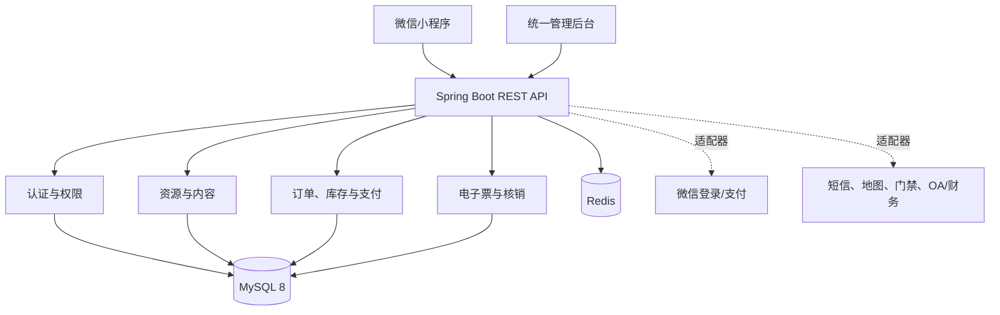

# 北方汇生活 - 概要设计（v0.1）

## 架构

## 分层与边界

| 层 | 职责 |
| --- | --- |
| `api` | REST 控制器、参数校验、鉴权、统一响应和错误码 |
| `application` | 用例编排：创建订单、取消订单、支付回调、核销等 |
| `domain` | 订单状态机、库存扣减、退款规则、审批规则 |
| `infrastructure` | JPA/MyBatis、Redis、对象存储及第三方适配器 |

首期采用模块化单体，按领域拆包；性能或组织边界明确时再拆分服务，避免在业务尚未稳定时过早引入 Spring Cloud 复杂度。

## 统一订单状态

`待支付 -> 已支付 -> 待使用/待履约 -> 已完成`

取消路径：`待支付 -> 已取消`；退款路径：`已支付/待使用 -> 退款中 -> 已退款`。所有状态变更写入订单事件/操作日志，支付与核销接口必须支持幂等。

## 安全原则

- 管理端、用户端、运维端使用分级角色与最小权限；关键操作留审计日志。
- 密码、令牌、支付密钥只通过环境变量或密钥服务提供；敏感字段脱敏展示。
- 输入校验、参数化查询、防 XSS 输出编码、限流与接口幂等作为开发验收项。
- 每日增量、每周全量备份由部署方案落实；数据库迁移脚本版本化管理。

## 开发里程碑

1. 平台底座：用户、角色、资源、订单、库存、支付适配器、核销、后台权限。
2. 预订闭环：住宿、餐饮、会议。
3. 票务与出行：景区、场馆、车辆及审批调度。
4. 商城、资讯、运营报表、外部系统联调、压测和安全测试。
