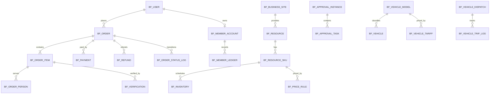

# 北方汇生活 - 数据库设计（v0.3）

## 1. 设计依据与范围

本设计以以下采购文件为业务权威来源：

- `“北方汇生活”微信小程序项目技术文本.pdf`：七大业务模块、统一后台、性能、安全、备份与验收要求。
- `具体要求.pdf`：首页及各详情页流程、实名信息、支付、配送、车辆计价、会员和订单交互细则。

数据库采用 MySQL 8.0+，字符集 `utf8mb4`，排序规则 `utf8mb4_0900_ai_ci`，业务时区 `Asia/Shanghai`。结构由 Flyway 的 V1-V3 迁移脚本管理；DBeaver 用于执行、审阅和生成 ER 图，不允许绕过迁移脚本直接修改生产表。

当前共 59 张表：V1 提供 11 张交易核心表，V2 增加 17 张平台公共表，V3 增加 31 张七大业务领域表。

## 2. 总体关系



## 3. 数据域与需求覆盖

| 数据域 | 主要表 | 对应要求 |
| --- | --- | --- |
| 用户与权限 | `bf_user`、`bf_role`、`bf_permission`、`bf_user_role`、`bf_role_permission` | 微信登录，用户端/管理端/运维端分级授权 |
| 会员 | `bf_member_account`、`bf_member_level`、`bf_member_ledger`、`bf_member_recharge` | 普通/白银/黄金等级、折扣、积分、充值、余额和消费明细 |
| 经营场所 | `bf_business_site` | 北方宾馆、后山住宿、兵器城、休闲场馆的介绍、地址、坐标和导航 |
| 统一资源 | `bf_resource`、`bf_resource_image`、`bf_resource_sku` | 房型、会议室、雅间、车辆、票种、体验项目、场地和商品统一目录 |
| 价格与套餐 | `bf_price_rule`、`bf_resource_package`、`bf_resource_package_item` | 节假日/淡旺季/时段/会员价格，住宿+餐饮/会议组合，景区套票 |
| 库存 | `bf_inventory`、`bf_inventory_log` | 日期时段库存、限流、防超售、批量出入库及可追溯流水 |
| 住宿会议 | `bf_hotel_booking`、`bf_meeting_booking`、`bf_order_person` | 入住退房、入住人实名、会议人数与使用记录、内部审批 |
| 餐饮配送 | `bf_dish_category`、`bf_dish`、`bf_dining_booking`、`bf_order_dish`、`bf_delivery_order` | 菜品/推荐/特价、雅间、50 元预订费、后厨状态、5 元场内配送和 30 分钟接单 |
| 景区场馆 | `bf_ticket_profile`、`bf_guide_content`、`bf_verification` | 成人/儿童/套票、实名电子票、浴都/体育馆时段票、体验项目、地图与语音导览 |
| 车辆 | `bf_vehicle_model`、`bf_vehicle`、`bf_driver`、`bf_vehicle_tariff`、`bf_vehicle_booking`、`bf_vehicle_dispatch`、`bf_vehicle_trip_log` | 内部审批/社会租赁、车型计价、押金、司机接单、位置、轨迹、里程、油耗和交还车 |
| 商城 | `bf_cart_item`、`bf_shipment`、`bf_coupon`、`bf_user_coupon` | 商品规格、购物车、地址、物流、满减/折扣/优惠券 |
| 交易售后 | `bf_order`、`bf_order_item`、`bf_payment`、`bf_refund`、`bf_after_sale`、`bf_order_status_log` | 统一订单、微信/银联/会员余额渠道、取消、退款、退换货和完整状态轨迹 |
| 内容运营 | `bf_banner`、`bf_home_entry`、`bf_article`、`bf_article_favorite`、`bf_platform_setting` | 首页 5 个快捷入口、轮播、公告、资讯分类/搜索/收藏、客服和公开参数 |
| 消息评价 | `bf_notification`、`bf_notification_setting`、`bf_review`、`bf_feedback` | 短信/站内通知偏好、商品/司机/服务评价、意见反馈和投诉 |
| 审批审计 | `bf_approval_instance`、`bf_approval_task`、`bf_audit_log` | 会议/内部用车多级审批、关键操作审计和对账依据 |

## 4. 统一资源与业务专表

资源类型包括：

`HOTEL_ROOM`、`RESTAURANT_TABLE`、`MEETING_ROOM`、`VEHICLE`、`SPORTS_VENUE`、`SCENIC_TICKET`、`PRODUCT`、`EXPERIENCE`。

名称、封面、上下架状态等公共字段放在 `bf_resource`；规格、基础价格放在 `bf_resource_sku`；强一致和高频查询字段进入业务专表。JSON 只保存低频扩展描述，不承载金额、库存、订单状态、实名信息、审批或资金流水。

## 5. 七大业务关键模型

### 5.1 住宿、会议与餐饮

- 住宿订单明细一对一关联 `bf_hotel_booking`，保存入住/退房日期、房间数、入住人数和实际办理时间。
- 会议订单明细一对一关联 `bf_meeting_booking`；内部会议通过 `bf_approval_instance` 和 `bf_approval_task` 逐级审批。
- 雅间预订默认预订费为 `5000` 分，可抵扣餐费；菜品快照保存在 `bf_order_dish`，避免改价影响历史订单。
- `bf_delivery_order` 仅允许关联 `delivery_enabled=1` 的场所。默认配送费 `500` 分，`accept_deadline` 支持 30 分钟未接单自动取消退款。

### 5.2 景区、体验与休闲场馆

- 成人票、儿童票、套票、浴都票、体育馆分时票和军事体验均使用资源/SKU/库存模型。
- `bf_ticket_profile` 结构化保存适用人群、实名要求、使用/退票/入园规则。
- 每位入园人或体验人保存为一条 `bf_order_person`；核销按人数/票数签发独立 `bf_verification`。
- 景点、地图点位、语音和攻略保存在 `bf_guide_content`。

### 5.3 车辆

- `business_mode` 区分 `INTERNAL` 和 `SOCIAL_RENTAL`；内部用车先审批，社会租赁进入支付与押金流程。
- `bf_vehicle_tariff` 已按《具体要求》第 7-8 页录入 9 类车型收费基线，金额从元换算为分。
- 司机必须在 `dispatch_deadline` 前接单；派车、司机、实时位置和服务状态保存在 `bf_vehicle_dispatch`。
- 轨迹、里程、油耗与交还车事件只追加到 `bf_vehicle_trip_log`。

### 5.4 商城与会员

- 商品继续使用 `PRODUCT` 资源和 SKU，分类使用 `category_code`，图片使用 `bf_resource_image`。
- 收货信息必须复制到 `bf_shipment.receiver_snapshot`，不能依赖可能被用户修改或删除的地址。
- 会员余额以 `bf_member_account` 为当前值、`bf_member_ledger` 为不可变流水；充值回调以渠道流水号幂等。普通/白银/黄金为初始等级名称，默认不打折，正式成长值与折扣须由采购方确认后配置。
- 优惠券实际抵扣金额写入订单快照；优惠券领取与使用由 `bf_user_coupon` 追踪。

## 6. 敏感数据与安全

- 姓名、手机号、身份证号、驾驶证号等实名字段由应用层使用密钥服务加密后写入 `VARBINARY` 密文字段。
- 需要等值检索或去重的证件号额外保存加盐/带密钥 SHA-256 摘要；严禁把身份证明文写入 JSON、日志或核销码。
- 微信 `openid/unionid`、支付流水、订单数据只允许最小权限账号访问；生产应用不得使用 `root`。
- 核销码只保存 SHA-256 摘要；支付、退款、充值、会员流水、库存流水和状态轨迹均使用唯一幂等键。
- 支付渠道字段保留扩展能力，但微信小程序内是否可使用支付宝/银联必须以微信平台规则和采购方实际签约渠道为准。
- 每日增量、每周全量备份由运维层实施，并定期做恢复演练；数据库设计本身不能替代备份任务。

## 7. 金额、库存和事务

- 全部金额采用 `BIGINT` 分，禁止 `FLOAT/DOUBLE`。
- 创建订单事务必须完成：校验资源与价格 -> 条件扣库存 -> 写库存流水 -> 写订单/快照 -> 写初始状态轨迹。
- 库存条件更新：

```sql
UPDATE bf_inventory
SET available_quantity = available_quantity - :quantity,
    version = version + 1
WHERE id = :inventoryId
  AND available_quantity >= :quantity
  AND version = :version;
```

- 影响行数为 0 表示库存不足或并发冲突。释放库存幂等键使用 `RELEASE:{orderNo}:{inventoryId}`。
- 订单状态通过条件更新迁移，同时写 `bf_order_status_log`；支付、退款、核销、司机接单与配送接单均不得只依赖 Redis 锁。

## 8. 状态字典

| 对象 | 状态 |
| --- | --- |
| 订单 | `PENDING_PAYMENT`、`PAID`、`WAITING_ACCEPT`、`READY`、`IN_SERVICE`、`COMPLETED`、`CANCELLED`、`REFUNDING`、`REFUNDED` |
| 支付/充值 | `PENDING`、`SUCCESS`、`CLOSED`、`FAILED` |
| 退款/售后 | `PENDING`、`PROCESSING`、`APPROVED`、`REJECTED`、`SUCCESS`、`FAILED`、`CLOSED` |
| 核销 | `UNUSED`、`USED`、`EXPIRED`、`VOID` |
| 审批 | `PENDING`、`APPROVED`、`REJECTED`、`CANCELLED` |
| 车辆派单 | `WAITING_DRIVER`、`ACCEPTED`、`IN_SERVICE`、`COMPLETED`、`TIMEOUT`、`CANCELLED` |
| 餐饮配送 | `WAITING_ACCEPT`、`ACCEPTED`、`DELIVERING`、`DELIVERED`、`RECEIVED`、`TIMEOUT`、`CANCELLED` |

状态由应用层枚举和状态机校验，数据库使用 `VARCHAR` 便于后续按采购方确认的退改规则扩展。

## 9. DBeaver 执行与验收

新环境执行顺序：

1. `db/dbeaver/00_create_database.sql`
2. `V1__init_core_schema.sql`
3. `V2__extend_platform_schema.sql`
4. `V3__add_business_domain_schema.sql`

已有 V1/V2 环境只执行 V3。执行后刷新 `beifanghui`，应有 59 张表、9 条车型、9 条车型收费规则和 3 条会员等级基线。

```sql
SELECT COUNT(*) AS table_count
FROM information_schema.TABLES
WHERE TABLE_SCHEMA = 'beifanghui' AND TABLE_TYPE = 'BASE TABLE';

SELECT COUNT(*) AS vehicle_model_count FROM bf_vehicle_model;
SELECT COUNT(*) AS vehicle_tariff_count FROM bf_vehicle_tariff;
SELECT COUNT(*) AS member_level_count FROM bf_member_level;

SELECT TABLE_NAME, INDEX_NAME,
       GROUP_CONCAT(COLUMN_NAME ORDER BY SEQ_IN_INDEX) AS columns
FROM information_schema.STATISTICS
WHERE TABLE_SCHEMA = 'beifanghui'
GROUP BY TABLE_NAME, INDEX_NAME
ORDER BY TABLE_NAME, INDEX_NAME;
```

## 10. 仍需采购方确认的配置

以下内容不得把 PDF 中的“示例值”误当成最终生产规则：正式房价、会议室和雅间清单、菜品与库存、景区/场馆票价、退改手续费、配送免单门槛、会员升级积分、优惠券预算、门禁接口、支付渠道、员工认证方式以及外部 OA/财务数据字段。表结构已为这些规则预留结构化配置入口，确认后通过管理后台或后续数据迁移录入，不再修改 V1-V3 历史脚本。
